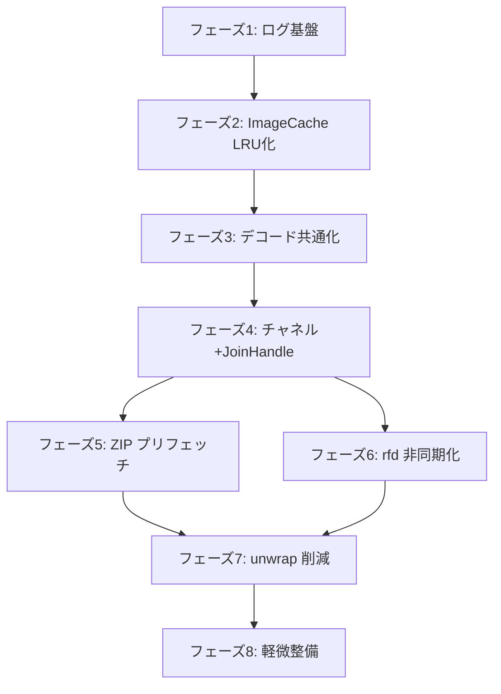

# RIMZE 設計改善 実行計画

本計画は [`plans/design_review.md`](plans/design_review.md) で承認された方針に基づき、**Orchestrator モードでサブエージェント（`new_task`）を起動して順次実行する**ためのものです。
各フェーズは1つの `new_task`（Code モード）として独立実行可能な粒度に分割しています。

---

## 🎯 全体方針

- **PDF サポート（#1）**: 本計画では対象外（全フェーズ完了後に別計画で実装）
- **`Directory` 構造体（#12）**: 現状維持
- **`Cargo.toml` の `*` 指定（#13）**: 今回は放置
- 各フェーズの終了条件: `cargo check`, `cargo fmt`, `cargo clippy` がエラー/警告なく通ること
- ただし「使っていない関数によるエラー」はユーザー指示により今回無視
- コメント・コミットメッセージは [`Agents.md`](Agents.md:23) に従い **日本語**

---

## 📐 アーキテクチャ変更の全体像



---

## フェーズ1: ログ基盤整理 + 未使用依存削除

**対象問題**: #8（ログ基盤混在）, #9（`async_zip` 未使用）

**変更内容**:
1. [`Cargo.toml`](Cargo.toml) から以下を削除:
   - `log = "0.4.20"`
   - `env_logger = "0.11.2"`
   - `simplelog = "0.12.2"`
   - `async_zip = { version = "*", features = ["full"] }`
2. [`src/main.rs`](src/main.rs:18) の `main()` で tracing-subscriber の設定を整える（環境変数 `RUST_LOG` でレベル調整可能に）
3. 新規モジュール [`src/metrics.rs`](src/metrics.rs) を作成し、プロセスのメモリ使用量を取得する関数を実装:
   - Linux: `/proc/self/status` の `VmRSS` を読む
   - `ImageCache::current_memory_usage`（[`src/content.rs`](src/content.rs:487)）と比較してログ出力
4. UI に簡易的なメモリ使用量表示を追加してもよい（オプション・低負荷間隔）

**終了条件**:
- `cargo check` が通る
- アプリ起動時に `INFO` ログでプロセスRSSとキャッシュ使用量が出力される
- `async_zip` が `Cargo.toml` から消え、`Cargo.lock` にも残らない

---

## フェーズ2: ImageCache を真の LRU 化 + Arc<Vec<u8>> 化 + tokio::Mutex 化 ★最優先

**対象問題**: #2（LRU 未達成）, #6（Vec<u8> クローン）, #7（`std::sync::Mutex`）

**変更内容**:

### 2-1. LRU データ構造の導入
- [`src/content.rs`](src/content.rs:481) の `ImageCache` を再設計
- `linked_hash_map` 相当を実装する方針（外部依存を増やさない場合は自前）:
  - `HashMap<CacheKey, (Arc<Vec<u8>>, キュー内の位置)>` + `VecDeque<CacheKey>` で順序管理
  - アクセス（`get`）時に該当キュー要素を末尾へ移動
  - `insert` 時にメモリ上限を超える場合、**キュー先頭から順にevict** しながら空きを作る
- 外部依存を許容するなら [`lru`](https://docs.rs/lru/) クレートの採用も検討（ユーザー判断）

### 2-2. 値型を `Arc<Vec<u8>>` に
- `cache: HashMap<CacheKey, Arc<Vec<u8>>>`
- [`ImageCache::get`](src/content.rs:522) は `Arc<Vec<u8>>` を返す（参照カウント増加分のみ）
- 呼び出し側（[`src/main.rs:583`](src/main.rs:583) 等）で `.clone()` によるフルコピーを削除

### 2-3. `tokio::sync::Mutex` 化
- [`src/main.rs:55`](src/main.rs:55): `Arc<tokio::sync::Mutex<content::ImageCache>>`
- ロック取得箇所（[`src/main.rs:322`](src/main.rs:322), [`src/main.rs:427`](src/main.rs:427), [`src/main.rs:583`](src/main.rs:583), [`src/main.rs:632`](src/main.rs:632), [`src/main.rs:693`](src/main.rs:693), [`src/main.rs:710`](src/main.rs:710)）をすべて `.await` 付き `lock().await` に変更
- 同期コンテキストから呼ばれている箇所は要注意（UIスレッド）。必要に応じて `try_lock` または `tokio_rt.block_on` ではなくタスク化

### 2-4. `set_max_memory_usage` の完成
- [`src/content.rs:626`](src/content.rs:626) の TODO を実装
- 上限を下げた瞬間に、超過分を LRU 古い順に evict

**終了条件**:
- 同一画像を何度開いてもプロセスRSSが上限付近で安定することを目視確認
- `cargo test` で LRU 挙動の単体テストを追加（access → evict の順序）

---

## フェーズ3: 画像デコード処理の共通化

**対象問題**: #11（DRY 違反）

**変更内容**:
- [`src/content.rs`](src/content.rs) に共通ヘルパを追加:
  ```rust
  pub fn decode_bytes_to_color_image(data: &[u8]) -> Option<egui::ColorImage> {
      let img = image::load_from_memory(data).ok()?;
      let size = [img.width() as _, img.height() as _];
      let rgba = img.to_rgba8();
      Some(egui::ColorImage::from_rgba_unmultiplied(
          size,
          rgba.as_flat_samples().as_slice(),
      ))
  }
  ```
- 以下の3箇所をこのヘルパで置換:
  - [`ImageFile::get_egui_color_image`](src/content.rs:148)
  - [`decode_and_display`](src/main.rs:665)
  - [`load_from_source_and_display`](src/main.rs:633)
- `get_egui_color_image` 自体が未使用であれば削除（ユーザー許容済みの「未使用関数」例外）

**終了条件**:
- デコードロジックが1箇所に集約
- `cargo clippy` で重複警告が出ない

---

## フェーズ4: チャネル差し替え + JoinHandle panic ハンドリング

**対象問題**: #5（`std::sync::mpsc`）, #14（`JoinHandle` 無視）

**変更内容**:

### 4-1. チャネルの差し替え
- [`src/main.rs:5`](src/main.rs:5), [`src/main.rs:204`](src/main.rs:204) を `tokio::sync::mpsc` に変更
- UIスレッド側の [`try_recv`](src/main.rs:131) ループは `try_recv()` 互換（`tokio::sync::mpsc::Receiver::try_recv` が存在）
- 非同期タスクからの送信側: `tx.send(...).await` または `tx.try_send(...)` に統一（`tokio::sync::mpsc::Sender::send` は async）
- チャネル容量は有限（例: `mpsc::channel(256)`）とし、`try_send` の `Full` エラーをログ
- メッセージ到着時に `ctx.request_repaint()` を呼ぶ仕組みを検討（egui の再描画トリガー）

### 4-2. `JoinHandle` のハンドリング
- 以下の6箇所の `tokio_rt.spawn(...)` を `tokio_rt.spawn(...)` の結果を監視するラッパ関数へ置換:
  - [`load_from_source_and_display`](src/main.rs:618)
  - [`try_trigger_thumbnail`](src/main.rs:606)
  - [`update_cache_and_prefetch`](src/main.rs:700)
  - [`load_and_open_path`](src/main.rs:442)
  - [`load_directory_content`](src/main.rs:544)
  - [`ui_file_drag_and_drop`](src/main.rs:376)
- ラッパ例:
  ```rust
  fn spawn_tracked(rt: &Runtime, task: impl Future<Output=()> + Send + 'static) {
      let handle = rt.spawn(task);
      rt.spawn(async move {
          if let Err(e) = handle.await {
              error!("Background task panicked: {}", e);
          }
      });
  }
  ```

**終了条件**:
- `std::sync::mpsc` がコードから消滅
- タスクpanic時に `error!` ログが出る

---

## フェーズ5: ZIP ページプリフェッチ実装

**対象問題**: #3（ZIP プリフェッチ未実装）

**変更内容**:
- [`src/main.rs:703`](src/main.rs:703) の `CacheKey::ZipEntry` ケースを実装
- 実装方針:
  ```rust
  CacheKey::ZipEntry(path, index) => {
      let comic_loader = self.comic_loader.clone();
      let zip_file = ...; // ComicFile から entries を取得して spawn タスクに move
      tokio::spawn(async move {
          // entries[index] のエントリ名を取り、comic_loader.load_image_from_zip で読込
          if let Some(entry) = entries.get(index) {
              if let Ok(data) = comic_loader.load_image_from_zip(&path, entry).await {
                  image_cache.lock().await.insert_prefetched_data(key, data);
              }
          }
      });
  }
  ```
- 難所: 現在の `update_cache_and_prefetch` は `ComicFile` への参照を持たず、`CacheKey` からエントリ名が取れない構造。`ComicFile` を spawn タスクに渡すか、`CacheKey` にエントリ名を持たせる設計変更が必要
- フェーズ2 の LRU 完成後、`insert_prefetched_data` がメモリ上限内で動作することを確認してから実装

**終了条件**:
- ZIP 内でページ送りした際、`debug!` ログでプリフェッチの開始/完了が確認できる
- 体感で2回目以降のページ送りが高速になる

---

## フェーズ6: rfd を AsyncFileDialog 化

**対象問題**: #4（UI スレッドブロック）

**変更内容**:
- [`src/main.rs:286`](src/main.rs:286) の `UiCommand::OpenFileDialog` 処理を非同期化:
  ```rust
  UiCommand::OpenFileDialog => {
      let tx = self.update_tx.clone();
      let last_dir = self.ui_state.last_open_dir.clone();
      self.tokio_rt.spawn(async move {
          let mut dialog = rfd::AsyncFileDialog::new();
          if let Some(dir) = last_dir {
              dialog = dialog.set_directory(dir);
          }
          dialog = dialog.add_filter("Image Files", &["png","jpg","jpeg","webp","gif","avif","zip","pdf"]);
          if let Some(handle) = dialog.pick_file().await {
              tx.send(UiUpdateMsg::FilePicked(handle.path())).await.ok();
          }
      });
  }
  ```
- [`UiUpdateMsg`](src/main.rs:83) に `FilePicked(PathBuf)` バリアントを追加
- [`update`](src/main.rs:131) の match で `FilePicked` を処理（既存の `open_new_file` を呼ぶ）
- `rfd` のバージョンは [`Cargo.toml`](Cargo.toml:31) の `0.15.3` を維持（`AsyncFileDialog` は 0.13+ で利用可能）

**終了条件**:
- ファイルダイアログ表示中もウィンドウ描画が止まらない
- 大量のプリフェッチ中にダイアログを開いても、UI がブロックされない

---

## フェーズ7: unwrap/expect 削減

**対象問題**: #10（コーディング規約違反）

**変更内容**:
- 特に優先して対処すべき箇所:
  - `Mutex::lock().unwrap()`（[`src/main.rs:322`](src/main.rs:322), [`src/main.rs:427`](src/main.rs:427), [`src/main.rs:583`](src/main.rs:583) 等）→ フェーズ2で tokio::Mutex 化済みなら `.await` で poison エラーをハンドル
  - [`src/main.rs:238`](src/main.rs:238), [`src/main.rs:239`](src/main.rs:239) の `fonts.families.get_mut(...).unwrap()` → `if let Some(...)` で安全に
  - [`src/main.rs:252`](src/main.rs:252) の `runtime::Builder::...build().unwrap()` → 起動失敗は `expect("明確な理由")` または `Result` で伝播
- フレームワーク要求の `Result` を返す関数（`fn main() -> Result<...>`）は `?` 演算子を活用
- `expect()` は本当に到達不能な場合のみ、理由を明確に書いて残す

**終了条件**:
- `cargo clippy` で `unwrap_used` / `expect_used`（clippy::restriction）が0件（許容する場合は `#[allow]` で明示）

---

## フェーズ8: 軽微整備まとめ

**対象問題**: #15, #16, #17, #18

**変更内容**:

### 8-1. #15: SortOrder コメント修正
- [`src/content.rs:211`](src/content.rs:211) の `Ascending` コメントを「古いものが先（時系列）」に修正

### 8-2. #16: 英語コメントの日本語化
- [`src/main.rs:103`](src/main.rs:103) のダミー `ui` メソッド内の英語コメントを日本語化

### 8-3. #17: Drop 実装で ThumbnailWorker::stop() を呼ぶ
- [`src/main.rs`](src/main.rs) の `MyApp` に `Drop` 実装を追加:
  ```rust
  impl Drop for MyApp {
      fn drop(&mut self) {
          self.thumbnail_worker.stop();
      }
  }
  ```

### 8-4. #18: スライダー上限を AppSettings に移動
- [`src/settings.rs`](src/settings.rs:20) の `AppSettings` に `max_cache_mb_upper_limit: usize` を追加（デフォルト: 例 4096）
- [`src/view.rs:121`](src/view.rs:121) のスライダー範囲を `10..=settings.max_cache_mb_upper_limit` に
- `ComicViewerAppState` を経由して view 側に上限を渡す

**終了条件**:
- コメントがすべて日本語
- アプリ終了時に `debug!` ログで ThumbnailWorker 停止が確認できる
- 設定ファイル（settings.yaml）に `max_cache_mb_upper_limit` が保存される

---

## ✅ 最終確認（全フェーズ完了後）

1. `cargo check` / `cargo fmt` / `cargo clippy` が警告なし
2. 手動テスト（[`PLAN.md`](PLAN.md:5) 参照）:
   - ZIP のページ送りがスムーズ（フェーズ5の効果確認）
   - 大量画像ディレクトリでRSSが安定（フェーズ2の効果確認）
   - ファイルダイアログ中もUIが応答（フェーズ6の効果確認）
3. [`plans/design_review.md`](plans/design_review.md) の方針表で「✓ 完了」をマーク
